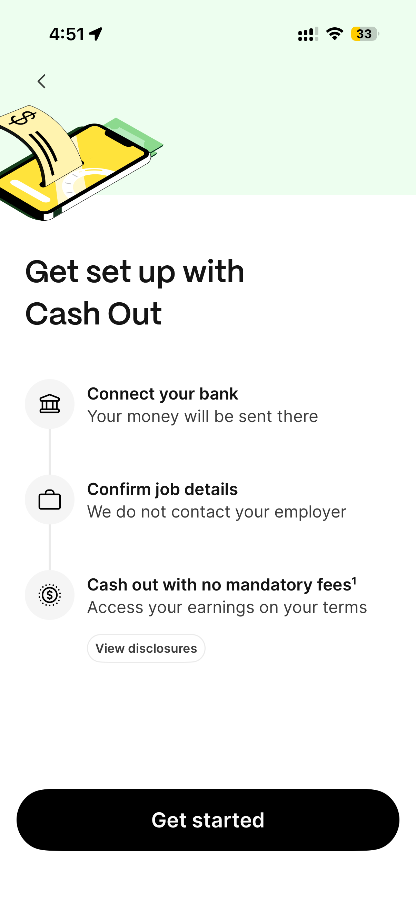
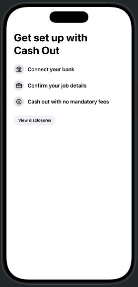
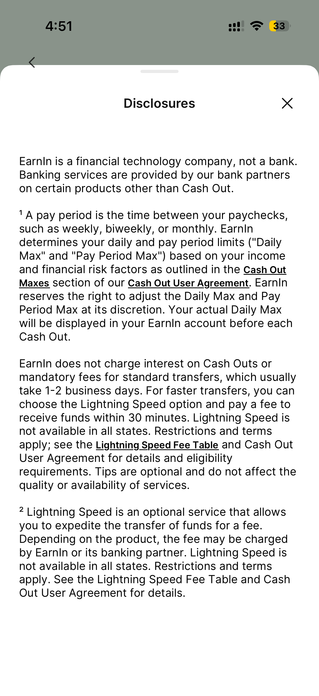
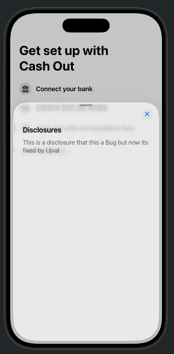

# EarnIn-Demo

I like the onboarding of the EarnIn app, but as a developer I tried to test the app, and after clicking the disclosure button, I found that it opens a **.sheet**.

The cross button works perfectly to close the sheet view, but the **presentationDragIndicator** is visible but not functional. When I tried to pull it down, I was not able to dismiss it.

So I created a SwiftUI app to reproduce this issue, fix it, and find the root cause. I built this in about 20 minutes using Xcode.

## App Preview

  
  

## What I Found

  
  

By default, interactive dismissal is allowed, but in my code I explicitly used  
**`.presentationDragIndicator(.visible)`**

I also used  
**`.presentationDragIndicator(.visible)`**

This helps users discover the drag gesture for dismissing the sheet.

So i feel either .interactive​Dismiss​Disabled(true), by other view in the sheet’s hierarchy so pull down is blocked or there might be Drag Gesture conflict or If UIkit is used the presentation style is not a sheet or a delegate is denying dismissal. 
